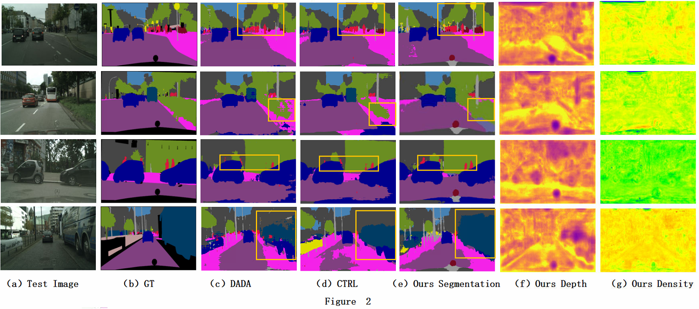
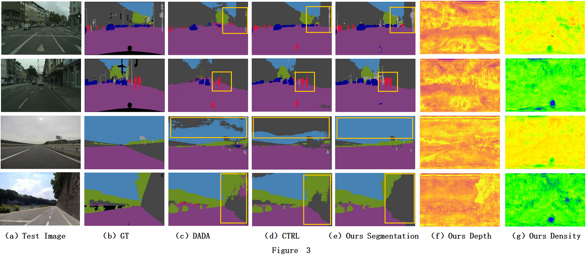
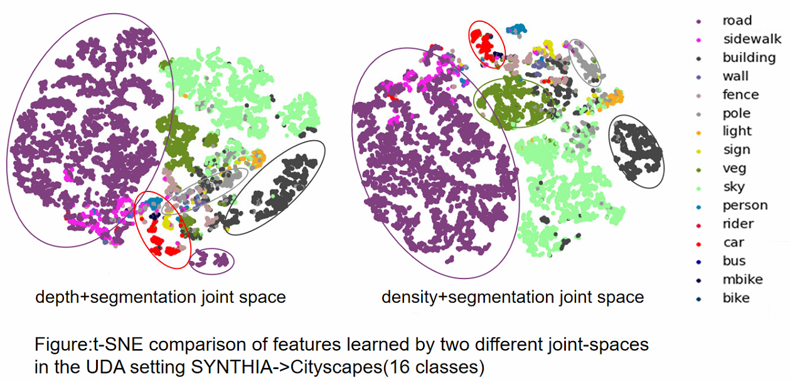

# Unsupervised Domain Adaptation for Semantic Segmentation using Depth Distribution


## Preparation

### Pre-requisites

* Python = 3.7
* Pytorch >= 1.2.0
* CUDA 10.0 or higher


## Train/Test

```bash
$ cd depth_distribution/main/scripts

# STEP-1: generate source_density_maps
$ python gene_sourceDensityMaps.py --expid=<experiment id>

# STEP-2: train
$ python train.py --expid=<experiment id>
# If you want to train based on the pre training model, you can execute the command
$ python train.py --expid=<experiment id> --pret_model='<trained model path,it should be noted that the pre-trained model name cannot be changed, and the corresponding adversarial network model should be placed in the same folder.>'
#The results of the training will be saved in the record.txt file

# STEP-3: generate pseudo labels
$ python gene_pseudoLabels.py --expid=<experiment id>  --pret_model='<trained model path>' --output_dir = '../../data/Cityscapes(here is Cityscapes or Mapillary )/pseudo_labels'                             

# STEP-4: self-train
$ python self_train.py --expid=<experiment id>  --pret_model='<trained model path>'

# STEP-5: test
$ python test.py --expid=<experiment id>  --pret_model='<trained model path>'
```
Where experiment ids are:
| Exp. Id | Description |
| -------- | -------- |
|  1   | SYNTHIA to Cityscapes 16 classes |
|  2    | SYNTHIA to Cityscapes 7 classes |
|  3   | SYNTHIA to Cityscapes 7 classes (low resolution) |
|  4    | SYNTHIA to Mapillary 7 classes |
|  5   | SYNTHIA to Mapillary 7 classes (low resolution) |

Download the weights from here  [Google Drive](https://drive.google.com/drive/folders/1R6IWvC6DHiYyyvXlxwljoS_BYyEBSPd4)  and put it in  folder  <project_root>/pretrained_models  for initializing resnet-101 backbone.

In addition, Gaussian mixture model parameters can be calculated by [gmm-torch](https://github.com/ldeecke/gmm-torch)


## Datasets

* **SYNTHIA**: Please follow the instructions [here](http://synthia-dataset.net/downloads/) to download the images.
  We used the *SYNTHIA-RAND-CITYSCAPES (CVPR16)* split. 
  Download the segmentation labels  [here](https://drive.google.com/file/d/1TA0FR-TRPibhztJI5-OFP4iBNaDDkQFa/view?usp=sharing). 
  The Cityscapes dataset directory should have this basic structure:
  
  "source_density_maps" are generated by "gene_sourceDensityMaps.py" in our project.
  
  ```bash
  <project_root>/data/SYNTHIA                           % SYNTHIA dataset root
  ├── RGB
  ├── parsed_LABELS
  ├── Depth
  └── source_density_maps
  ```
  
* **Cityscapes**: Please follow the instructions in [Cityscape](https://www.cityscapes-dataset.com/) 
  to download the images and validation ground-truths. 
  The Cityscapes dataset directory should have this basic structure:
  
  ```bash
  <project_root>/data/Cityscapes                       % Cityscapes dataset root
  ├── leftImg8bit
  │   ├── train
  │   └── val
  └── gtFine
      └── val
  ```
  
* **Mapillary**: Please follow the instructions in [Mapillary](https://www.mapillary.com/dataset) 
  to download the images and validation ground-truths. 
  The Mapillary dataset directory should have this basic structure:
  
  ```bash
  <project_root>/data/Mapillary                        % Mapillary dataset root
  ├── train
  │   └── images
  └── validation
      ├── images
      └── labels
  ```


## Pre-trained models

+ Pre-trained models are provided here   [Google Drive](https://drive.google.com/drive/folders/1R6IWvC6DHiYyyvXlxwljoS_BYyEBSPd4).

  We provide all pre-trained models of our paper(11 models).

1. Syn_City_16cls(M4).pth represents SYNTHIA-->Cityscapes 16 class and M4 in Table 3.  
2. Syn_City_7cls.pth represents SYNTHIA-->Cityscapes 7 class.  
3. Syn_City_7cls_small.pth represents SYNTHIA-->Cityscapes 7 class (low resolution).  
4. Syn_Map_7cls.pth represents SYNTHIA-->Mapillary 7 class.  
5. Syn_Map_7cls_small.pth represents SYNTHIA-->Mapillary 7 class (low resolution).  
6. M1.pth represents  M1 in Table 3.  
7. M2-S4.pth represents  M2 in Table 3 and S4 in Table 4. 
8. M3.pth represents  M3 in Table 3.  
9. S1.pth represents  S1 in Table 4.  
10. S2.pth represents  S2 in Table 4.  
11. S3.pth represents  S3 in Table 4.  

Note that all the models of M1...M4,S1...S4 are trained and evaluated on SYNTHIA → Cityscapes  16 classes.


## Acknowledgement 

+ DADA and CTRL are used as our baseline and coding reference [DADA](https://github.com/valeoai/DADA) and [CTRL](https://github.com/susaha/ctrl-uda).


## Additional experiments according to reviewers 

+ We added the results of depth and density to Figure 2 and Figure 3.







+ t-SNE visualization for segmentation results of Cityscape test images by two different joint-space features




+ Additional training models based on different adversarial features: segmentation feature, density feature, depth+segmentation feature.

​        Additional training models are provided here   [Google Drive](https://drive.google.com/drive/folders/1R6IWvC6DHiYyyvXlxwljoS_BYyEBSPd4).


+ GMM Parameters

​       GMM Parameters are provided here   [Google Drive](https://drive.google.com/drive/folders/1R6IWvC6DHiYyyvXlxwljoS_BYyEBSPd4).